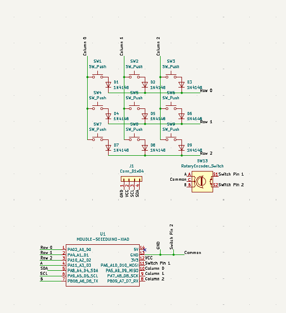
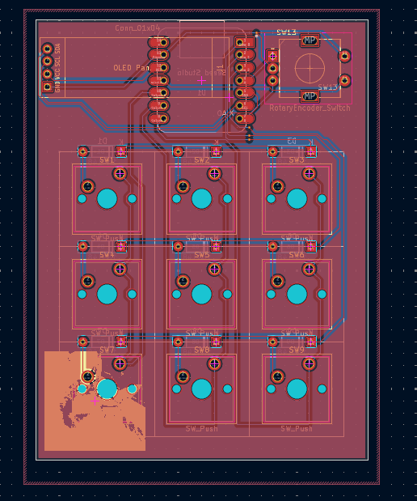
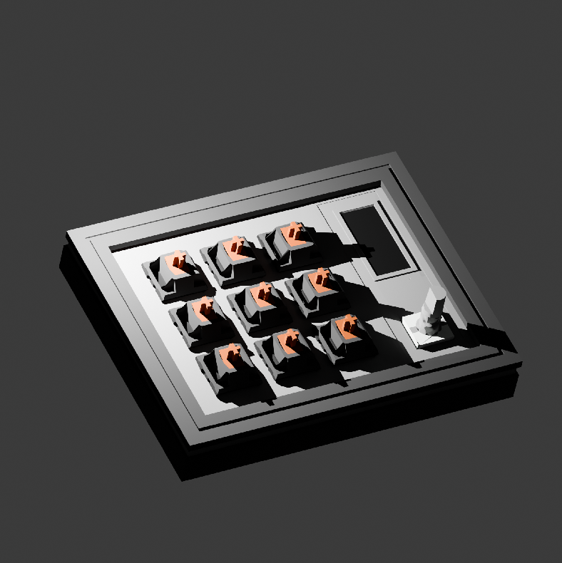
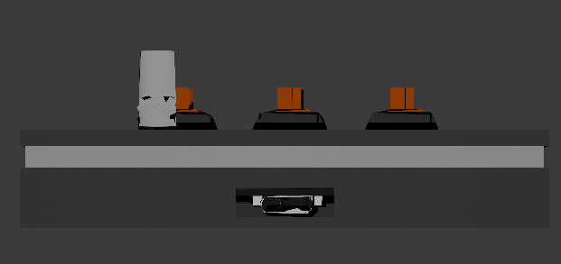

# Stormy 9 - A Macropad Designed for Simplicity
## *In today's age of mechanical keyboards, people value simplicity and customizability. The Stormy 9 allows this by having up to 16 programmable buttons, a knob to adjust volume and brightness, and an OLED display that shows off your WPM and a cute picture of my cat (non-negotiable).*

### \* *The case is mounted from the bottom. In my current setup, a top mounted case would look bad (not saying top mounted cases look ugly or anything, it just wouldn't work for my personal setup).*

## Personal Use:
####  A bit off topic, but I'm probably going to use this macropad for additional keybinds for video games (probably CS2 with their buy menu). Also, I've always desired to adjust my volume and brightness with ease as my current keyboard doesn't have a knob.

## PCB Schematic (Made with KICAD)
 

#### I learned PCB schematics through ScottoKeeb's tutorial (https://youtu.be/8WXpGTIbxlQ?si=Y5YSVLcabkqrECWy). It was genuinely super helpful and I would've spent so many more hours without it.

## PCB Layout

## 3D Model of The Stormy 9
#### For context, I tried using Fusion-360 to design the case (like any normal person would). However, Fusion-360 refused to import STEP and STL files (I wanted to import the 3D model of my PCB for rendering and ease of modeling), forcing me to voluntarily choose Blender. Contrary to popular belief, Blender was actually super easy and useful to model the case. For anyone planning to design their case in Blender, please google what non-manifold edges are before starting (it will save you so much time in the future). To convert the models to STEP files, I utilized the open-sourced software, FreeCAD.

## 3D render of the backside of the Stormy 9

## Firmware
### For the firmware, I utilized the open-source project, QMK. I found this to be a lot better than KMK as it's still officially maintained and gave developers a lot more granular control. It also forces you to code in C rather than Python (Take that as a bonus or a burden). 

# __Materials Needed:__
### * 1 Seeed XIAO RP2040 Microcontroller
### * 9 1N4148 Through-Hole Diodes
### * 9 MX-style Mechanical Switches
### * 1 EC11 Rotary Encoder
### * 1 0.91" 128X32 OLED Display
### * 9 Blank DSA Keycaps
### * 4 M3x16mm Screws
### * 4 M3x5x4mm Heatset Inserts
### * Sanity